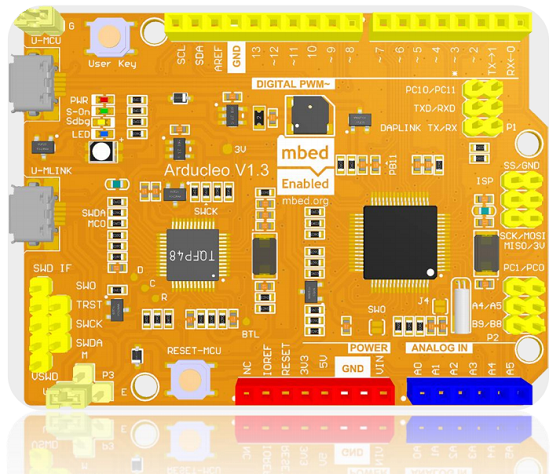

The Arducleo Samples & Hardware  

# 1. Overview
arducleo is a stm32f103rb based development board with arduino interface, compatible with mbed. 

The Arducleo has 
- 14 digital input/output pins (of which 6 can be used as PWM outputs), 
- 6 analog inputs, 
- a 8 MHz quartz crystal and an optional 32.768khz quartz crystal, 
- three USB connection(one is for android cellphone charger connection, one is for in-box swd debuger, and another is for target mcu usb connection), 
- and two buttons(one is for reset target, another is for user input),
- a buzzer driven by PB_1,
- a RGB color LED driven by PC_6, PC_8, PC_9.

# 2. Technical specs

<table>
 <tbody>
  <tr>
    <td>Microcontroller</td>
    <td>STM32F103RB, 32-Bit ARM Cortex M3</td>
  </tr>

  <tr>
    <td>Operating Voltage</td>
    <td>3.3V</td>
  </tr>

  <tr>
    <td>Digital I/O Pins</td>
    <td>20</td>
  </tr>
  <tr>
    <td>PWM Pins</td>
    <td>All but pin 10, 13</td>
  </tr>
  <tr>
    <td>UART </td>
    <td>2 (Native and Trace)</td>
  </tr>

   <tr>
    <td>Analog Input Pins</td>
    <td>6, 12-bit ADC channels</td>
  </tr>

  <tr>
    <td>Analog Output Pins</td>
    <td>2, 12-bit DAC</td>
  </tr>

  <tr>
    <td>External Interrupts</td>
    <td>All pins except pin 4</td>
  </tr>

  <tr>
    <td>Flash Memory</td>
    <td>128 KB</td>
  </tr>

  <tr>
    <td>SRAM</td>
    <td>20 KB</td>
  </tr>

  <tr>
    <td>EEPROM</td>
    <td>None. See documentation</td>
  </tr>

  <tr>
    <td>Clock Speed</td>
    <td>72 MHz</td>
  </tr>

 </tbody>
</table>          

# 3. Documentation

For user manual, here is one in Chinese: ' [Arducleo_UM_rev160830_v13_chs.pdf](./scripts/doc/Arducleo_UM_rev160830_v13_chs.pdf "") '

## 3.1 schematic 

Please refer to ' [Arducleo_sch_rev160830_v13.pdf](./scripts/doc/Arducleo_sch_rev160830_v13.pdf "") '

## 3.2 In-box SWD Debuger

This board has build-in swd debuger - DAPLink. 

by using a msd bootloader(mLink), we can upgrade the DAPLink firmware.

## 3.3 Power Supply

The Arducleo can be powered via the USB connector or with an external power supply, and the DAPLink supply. The power source is selected by P3 jumper.

External power can come either from the 'U-5V' or the 'VIN' connector, they are only 5V supply.

## 3.4 Memory

The Arducleo has 128 KB Flash Memory and 20 KB of SRAM. 

## 3.5 Input and Output

Each of the 20 general purpose I/O pins on the Arducleo can be used for digital input or digital output by instantiate class DigitalIn, or DigitalOut.

Pins that can be used for PWM output are: 3, 4, 5, 6, 8, 9, 11, 12, 13 using PWMOut class. All pins operate at 3.3 volts. Each pin can source or sink a maximum of 25 mA and has an internal pull-up resistor (disconnected by default) of 30-50 kOhms.

The target mcu can tolerate total current is 150mA.

In addition, some pins have specialized functions:

    Serial: 0 (RX) and 1 (TX). Used to receive (RX) and transmit (TX) TTL serial data. These pins are connected to the Serial class. 
    
    External Interrupts: available on all the pins, using class InterruptIn.
    
    DAC: PA_4, PA_5. Provide a 12bit voltage output with the class AnalogOut. (Note: RB without DAC supporting; RC has DAC hardware, but need to modify the mbed source code.]
    
    PWM: 2, 3, 4, 5, 6, 8, 9, 11, 12. Provide 12-bit PWM output using class PWMOut.
    
    SPI: SS, MOSI, MISO, SCK. Located on the ICSP header, using class SPI as master, or class SPISlave as slave.
    
    I2C: SDA pin and SCL pin, using class I2C.

    LED: D13 aka PA_5. There is a built-in LED driven by digital pin D13 using class DigitalOut. When the pin is HIGH value, the LED is on, when the pin is LOW, it's off. 
    
    RGB color LED: driven by PC_6(Blue), PC_8(Green), PC_9(Red).
    
    Analog Inputs. 6 general purpose I/O pins on the Arducleo provide analog input. These are labeled A0, A1, A2, A3, A4, A5, and each provide up to 12bits of resolution (i.e. 4096 different values). By default they measure from ground to 3.3 volts, though is it possible to change the upper end of their range using the AREF pin.
    
There are a couple of other pins on the board:

    AREF. Reference voltage for the analog inputs. Used with analogReference().
    
    Reset. Bring this line LOW to reset the microcontroller. Typically used to add a reset button to shields which block the one on the board.

## 3.6 Programming

To upload new program to the Target MCU, you can use the swd interface or by drag&drop the .bin/.hex file to the msd drive.

## 3.7 Pin map

&nbsp; &nbsp; 

## 3.8 Resource

&nbsp; &nbsp; 

